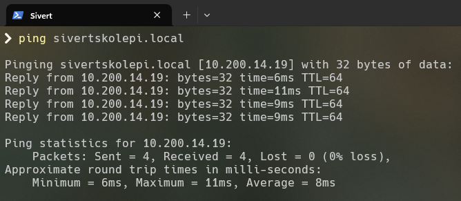
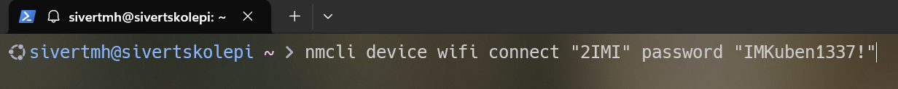
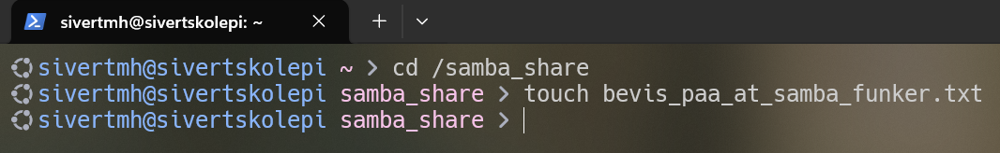
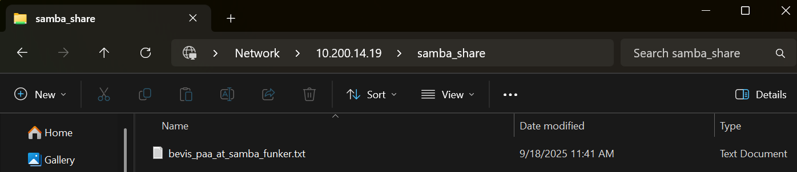

# Nettverk og Tjenester - Oppdrag 1, 2IMI uke 38 2025

I dette oppdraget skal jeg koble en Raspberry Pi, som skal tilby ulike tjenester, med min skole-PC via klassens nettverk. Server-Pi-en skal ha statisk IP-adresse, mens skole-pc-ens skal være en dynamisk. Dokumentasjon skal ligge ute på Github [her](https://github.com/sivertmh/nettverk_og_tjenester_oppdrag1_2IMI2025w38).

## IP-adresser og Annen Nettverksinfo

**SMHIMI2-15 (skole-laptop):**

* dynamisk IP-addresse: 10.2.1.253

**sivertskolepi (Raspberry Pi):**

* statisk IP-addresse: 10.200.14.19

**Nettverket (Kuben.it):**

* nettmaske (subnet mask): 255.0.0.0
* default gateway: 10.0.0.1 
* DNS: 10.0.0.10, 8.8.8.8 og 1.1.1.1

## Mitt Oppsett av Tjenestene

### Generelt Nettverk

**Min .yaml i /etc/netplan/ for sivertskolepi (for å få statisk IP-addresse):**

```
network:
  version: 2
  renderer: networkd
  wifis:
    wlan0:
      dhcp4: no
      addresses:
        - 10.200.14.19/8
      gateway4: 10.0.0.1
      nameservers:
        addresses:
          - 10.0.0.10
          - 8.8.8.8
          - 1.1.1.1
      access-points:
        "Kuben.it":
          password: "IMKuben1337!"
```

Bevis på at en kobling er etablert mellom Pi og Laptop:


For å koble de sammen brukte jeg nmcli:



### Samba 

Først må du installere samba:

`sudo apt install samba`

Så lage en mappe som skal deles og gi den tillatelser til å kunne endres av alle:

```
sudo mkdir /samba_share
sudo chmod 777 /samba_share
```

Åpne konfigurasjonsfilen til Samba med en texteditor (nano blir brukt her):

`sudo nano /etc/samba/smb.conf`

I filen legg til:

```
[samba_share]
    comment = Samba Shared Directory
    path = /samba_share
    read only = no
    guest ok = yes
```

Lag samba-bruker (det kan hende du vil ignorere første linje, hvis du har en bruker laget for deling. Hvis du lager ny kan du bytte ut "smbusr" med ett valgfritt navn.):

```
sudo useradd smbusr
sudo smbpasswd -a smbusr
```

Til slutt, restart service-en:

`sudo systemctl restart smbd nmbd`

Hvis du har ufw som brannmur:

```
sudo ufw allow samba
sudo ufw allow 445
```

**På bildene under ser du at Samba fungerer som det skal:**

Fra linux (tjener):


Fra Windows (skole-pc, klient):



### Jellyfin

